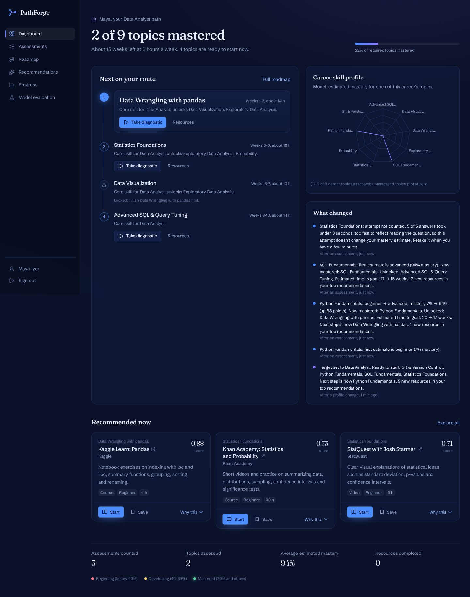
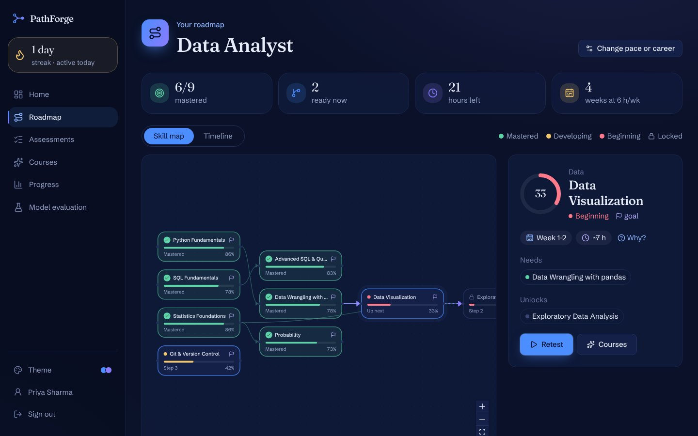
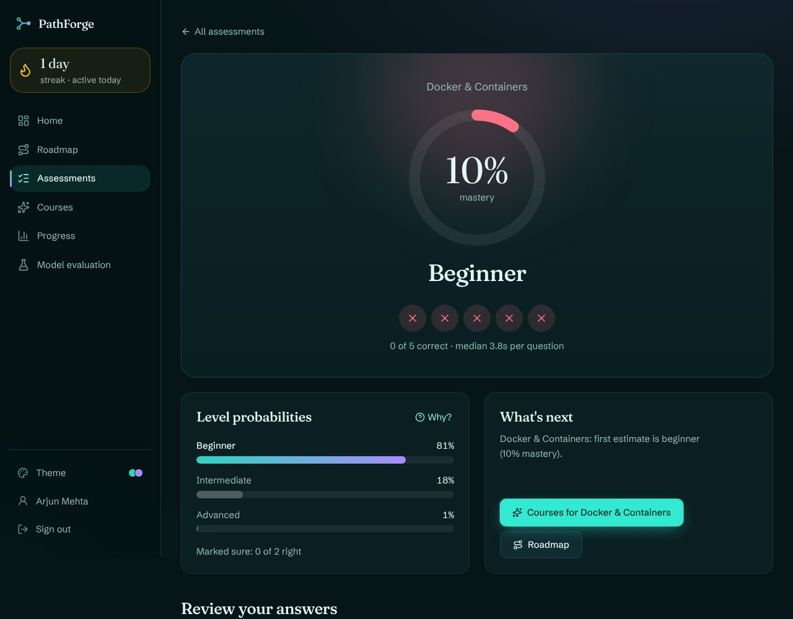
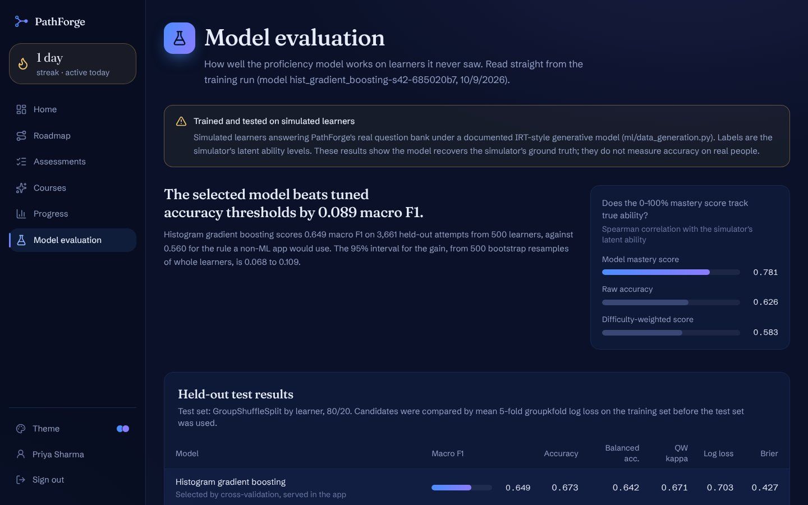

# PathForge AI

Adaptive learning paths for technical careers. A learner picks a target career, takes short topic diagnostics, and gets:

- a **proficiency estimate per topic** from a trained, evaluated classifier (with probabilities, not just a score),
- a **prerequisite-aware roadmap** built with NetworkX, scheduled into weeks from their study time,
- **content-based resource recommendations** (TF-IDF + cosine similarity) with a breakdown of why each one ranks where it does,
- an **adaptive loop**: every submission updates mastery, unlocks topics, re-ranks resources and records what changed.

The model evaluation page publishes every metric from the training run, including the baselines it is compared against and the limitations of training on simulated learners.

| Dashboard | Roadmap |
|---|---|
|  |  |
| **Assessment result** | **Model evaluation** |
|  |  |

| Layer | Technology |
|---|---|
| Frontend | Next.js 16 (App Router, Cache Components), React 19, TypeScript, Tailwind CSS 4, shadcn-style components on Radix, Lucide, Framer Motion, Recharts 3, React Flow 12, TanStack Query |
| Auth & data | Supabase Auth, Supabase PostgreSQL with row-level security |
| API | Python 3.13, FastAPI, Pydantic 2, psycopg 3 (connection pool), PyJWT |
| ML | pandas, NumPy, scikit-learn 1.9, NetworkX, joblib |
| Hosting | Vercel (frontend), Render (API), Supabase (database + auth) |

---

## Architecture

```
Browser ──(Supabase Auth: email + password)──► Supabase Auth
   │  access token (JWT)
   ▼
Next.js on Vercel ── proxy.ts refreshes the session cookie and guards learner pages
   │  fetch + Authorization: Bearer <JWT>
   ▼
FastAPI on Render ── verifies the JWT (JWKS or HS256 secret), validates input,
   │                 runs inference / roadmap / ranking in-process
   │  privileged Postgres connection (server-side only)
   ▼
Supabase Postgres ── catalog (public read), learner data (RLS: own rows only),
                     answer keys (no client access at all)
```

- **One data path.** The browser never reads learner tables directly; all reads and writes go through the API. RLS is still enforced as defence in depth, and the RLS tests exercise it as the `anon` and `authenticated` roles.
- **Scores can't be forged.** Learners have no insert/update rights on assessments, responses or mastery. Correctness is computed on the server from answer keys that clients cannot select.
- **The catalog is code.** Careers, topics, prerequisite edges, 108 resources and 156 questions live in `backend/ml/catalog_data/*.json`, validated on load (unique IDs, acyclic prerequisites, coverage). `supabase/seed.sql` is generated from it, and CI fails if the two drift.

### Repository layout

```
backend/
  app/            FastAPI: config, auth, db pool, repository (SQL), services, routers
  ml/
    catalog.py        catalog loader + validation (DAG check, coverage)
    catalog_data/     careers, topics, resources, questions (JSON, source of truth)
    features.py       feature extraction shared by training and serving + attempt-validity rule
    item_selection.py adaptive question selection (shared by the API and the simulator)
    data_generation.py  SYNTHETIC learner simulator (clearly labelled)
    train.py          model selection, refit, artifacts
    evaluate.py       held-out metrics, baselines, calibration, importance, behavioural/system checks
    inference.py      loads the artifact and predicts
    recommender.py    TF-IDF content index
    ranking.py        explainable ranking
    roadmap.py        prerequisite-aware roadmap + constraint checker
    artifacts/        proficiency_model.joblib, metrics.json
  scripts/        seed generation, local DB reset, metric reproducibility check, local auth stand-in
  tests/          ML unit tests, API integration tests, RLS tests
frontend/         Next.js app (src/app, src/components, src/lib)
supabase/         migrations/, seed.sql, config.toml
e2e/              browser end-to-end test (puppeteer)
docs/model-card.md
render.yaml       Render blueprint for the API
.github/workflows/ci.yml
```

---

## How it works

### Assessments and proficiency estimation

Each topic has six questions (two each of easy, medium, hard). A diagnostic shows five, easy to hard. Retakes prefer unseen questions, and once a learner is past beginner the mix shifts toward hard items. For each answer the app records correctness, a self-rated confidence (guessing / unsure / sure) and the time spent while the tab was visible.

`ml/features.py` turns an attempt into 16 features: accuracy overall and per difficulty, difficulty-weighted score, bounded response-time ratios (excluding rapid guesses), confidence patterns (sure-and-wrong, lucky guesses), a rapid-guess rate, accuracy on prerequisite topics and the topic's depth in the graph. The same function is used in training and in the API, so there is no training/serving skew.

The classifier predicts **beginner / intermediate / advanced**. The app shows the probabilities and a mastery score, `P(intermediate) × 0.5 + P(advanced)`. A topic counts as mastered at 70%.

**Attempt validity.** If three or more of five answers take under three seconds, the attempt is stored but not counted: rapid guesses carry no information about ability. This rule exists because end-to-end testing found an earlier model rating fast, all-wrong guessing as advanced (see [the model card](docs/model-card.md#history)).

### Roadmap

`ml/roadmap.py` takes the career's goal topics plus all their transitive prerequisites, drops mastered topics, and orders the rest with `networkx.lexicographical_topological_sort`. Priority favours topics the career weights highly and topics that unlock many weighted descendants. A topological order guarantees every unmastered prerequisite comes first; `check_prerequisite_order` verifies it, and both the unit tests (200 random states) and each training run (600 random states) check that there are zero violations. Steps are scheduled into weeks from estimated remaining hours and the learner's weekly study time.

### Recommendations

Candidates come only from **unlocked** roadmap topics (all prerequisites mastered), so recommendations never jump ahead of the graph; requesting a locked topic returns 409 with the missing prerequisites. Each candidate's score is a weighted sum of interpretable components:

| Component | Weight | Meaning |
|---|---|---|
| Content match | 0.35 | TF-IDF cosine similarity between the resource and a query from the topic, the learner's goal and career, normalised within the topic |
| Roadmap position | 0.25 | Earlier roadmap steps rank higher |
| Level fit | 0.20 | Resource difficulty vs. the level implied by the mastery estimate |
| Format preference | 0.12 | Matches the learner's preferred formats |
| Fits your week | 0.08 | Resource length vs. weekly study time |

The interface shows each component's contribution, the reasons in plain language, and the terms that drove the TF-IDF match. Completed resources drop out; at most three per topic are shown.

### Adaptive loop

After a counted submission the API computes the roadmap and top recommendations before and after the update and stores an **adaptation event**, for example:

> Python Fundamentals: beginner → advanced, mastery 7% → 94% (up 88 points). Now mastered: Python Fundamentals. Unlocked: Data Wrangling with pandas. Estimated time to goal: 20 → 17 weeks.

Profile changes (career, pace, preferences) and completed resources also create events.

---

## ML results

Figures from the committed training run (`backend/ml/artifacts/metrics.json`); CI retrains with the fixed seed and fails if they don't reproduce.

**Data:** 2,500 simulated learners, 18,357 topic attempts. Split by learner (80/20): 14,696 training and 3,661 test attempts, with no learner in both. Candidates were compared with 5-fold GroupKFold on the training learners only, selecting by mean log loss.

| Model (held-out test set) | Macro F1 | Accuracy | Balanced acc. | QW kappa | Log loss |
|---|---|---|---|---|---|
| Histogram gradient boosting (selected) | 0.649 | 0.673 | 0.642 | 0.671 | 0.703 |
| Multinomial logistic regression | 0.649 | 0.672 | 0.643 | 0.669 | 0.702 |
| Random forest | 0.638 | 0.668 | 0.627 | 0.655 | 0.720 |
| Baseline: raw accuracy thresholds, tuned on train | 0.560 | 0.600 | 0.550 | 0.532 | n/a |
| Baseline: majority class | 0.209 | 0.457 | 0.333 | 0.000 | 11.253 |

- Macro-F1 gain over the threshold baseline: **0.089** (95% CI 0.068 to 0.109, bootstrap over whole learners).
- Calibration: expected calibration error **0.011**.
- The mastery score tracks the simulator's latent ability better than raw accuracy (Spearman **0.781** vs 0.626).
- Gradient boosting and logistic regression are effectively tied; boosting won cross-validation by less than one fold-to-fold standard deviation and is marginally worse on test log loss.
- All 9 behavioural checks pass (e.g. all-wrong at any speed → beginner; all-right at a normal pace → advanced; rapid clicking → not counted).
- Roadmaps: 0 prerequisite violations in 600 random roadmaps (6,043 steps). TF-IDF topic retrieval sanity check: precision@3 0.92, MRR 1.00 (random: 0.04, 0.14).

**These numbers measure how well the model recovers the simulator's ground truth, not how accurate it is for real people.** Read the [model card](docs/model-card.md) before relying on them.

---

## Local development

Prerequisites: Python 3.13, Node 22, and either the [Supabase CLI](https://supabase.com/docs/guides/local-development) (needs Docker) or a hosted Supabase project.

### 1. Database

**With the Supabase CLI (recommended):**

```bash
supabase start          # local Postgres + Auth; prints the API URL, anon key and DB URL
supabase db reset       # applies supabase/migrations/* and supabase/seed.sql
```

**With a hosted project:**

```bash
supabase link --project-ref <project-ref>
supabase db push --include-seed
```

Without the CLI you can paste the migration files in order, then `seed.sql`, into the SQL editor.

### 2. Backend

```bash
cd backend
python3.13 -m venv .venv && source .venv/bin/activate
pip install -r requirements-dev.txt
cp .env.example .env            # set DATABASE_URL and SUPABASE_URL (or SUPABASE_JWT_SECRET)
python -m ml.train              # optional: artifacts are committed; this reproduces them (~35 s)
uvicorn app.main:app --reload --port 8000
```

`GET /health` reports the model version and whether the database catalog matches the JSON catalog. Interactive API docs are at `/docs` outside production.

### 3. Frontend

```bash
cd frontend
npm install
cp .env.example .env.local      # Supabase URL + anon key, API URL
npm run dev                     # http://localhost:3000
```

### Without Docker

`backend/scripts/reset_local_db.sh` builds a local database on plain PostgreSQL using a small stub of Supabase's `auth` schema (`backend/tests/sql/supabase_auth_stub.sql`). `backend/scripts/local_auth_mock.py` is a minimal stand-in for the few Supabase Auth endpoints the frontend calls, so you can click through the app. Both are test harnesses: the reset script refuses hosted Supabase hosts, the auth stand-in refuses non-local databases, and neither belongs in production.

```bash
export PGHOST=/tmp PGPORT=5432 PGUSER=postgres && ./scripts/reset_local_db.sh
export DATABASE_URL="postgresql://postgres@/pathforge?host=/tmp" SUPABASE_JWT_SECRET="any-32-char-dev-secret-value-here"
uvicorn scripts.local_auth_mock:app --port 54321 &
uvicorn app.main:app --port 8000
# frontend/.env.local: NEXT_PUBLIC_SUPABASE_URL=http://localhost:54321, any non-empty anon key
```

---

## Tests

| Suite | Command | Covers |
|---|---|---|
| ML unit tests | `cd backend && pytest tests/test_ml.py` | catalog integrity, features, item selection, simulator reproducibility, roadmap constraints, ranking explanations, model behaviour, metrics/artifact consistency |
| API integration | `TEST_DATABASE_ADMIN_URL=postgresql://postgres@localhost:5432/postgres pytest tests/test_api.py` | auth failures, validation, private assessments, double submit, the full adaptive loop, rapid-guess exclusion, recommendations, progress, analytics |
| RLS | `pytest tests/test_rls.py` | own-row isolation, hidden answer keys, no client writes to scores or catalog |
| Frontend unit | `cd frontend && npm test` | formatting, mastery thresholds, heatmap ramp monotonicity, query strings |
| End to end | see below | real browser through the whole product |

The database tests create and drop a throwaway `pathforge_test` database (migrations + seed) and are skipped when PostgreSQL isn't reachable.

**End to end** (needs the API, auth and a production frontend build running):

```bash
cd backend && python -m scripts.export_e2e_answers     # answer key for the test (gitignored)
cd ../e2e && npm install && node flow.mjs              # CHROME_PATH=... to use a local Chrome
```

It signs up, onboards, takes a weak diagnostic, a strong retake and a rapid-click attempt (which must not count), then checks the roadmap, recommendations (including an unlocked topic), analytics, the model page and the mobile layout. It fails on page errors, failed API calls or horizontal overflow, and saves screenshots to `e2e/shots/`.

**CI** (`.github/workflows/ci.yml`) runs on every push and PR: seed/catalog sync, deterministic retraining with a metrics reproducibility check, all backend tests against Postgres 16, and frontend lint, typecheck, unit tests and production build.

---

## Deployment

1. **Supabase.** Create a project and apply the schema with `supabase db push --include-seed`. Under Authentication → URL configuration, set the site URL to your Vercel domain and add `https://<domain>/auth/callback` as a redirect URL.
2. **Render (API).** New → Blueprint, pointing at this repo; `render.yaml` defines the service. Provide `DATABASE_URL` (Supabase → Connect → the pooler connection string), `SUPABASE_URL` and `CORS_ORIGINS` (your Vercel URL). The build installs pinned dependencies and retrains the model so the artifact matches the installed scikit-learn. Health check: `/health`.
3. **Vercel (frontend).** Import the repo with root directory `frontend`, and set `NEXT_PUBLIC_SUPABASE_URL`, `NEXT_PUBLIC_SUPABASE_ANON_KEY` and `NEXT_PUBLIC_API_URL` (the Render URL).

**Secrets.** The database URL is the only privileged credential and exists only on Render. The frontend holds public values only; the anon key is safe to expose because RLS governs every table. The API verifies tokens against the project's JWKS (asymmetric signing keys). For projects still on the legacy shared secret, set `SUPABASE_JWT_SECRET` instead.

The connection pool disables prepared statements, so it works with Supabase's transaction-mode pooler.

### Demo accounts

Three demo learners show what the app looks like after weeks of use. Sign in with any of them (password `PathForgeDemo2026`):

| Account | Career | History |
|---|---|---|
| `priya.sharma@example.com` | Data Analyst | ~13 weeks: 17 assessments (one excluded as rapid guessing), 7 topics mastered, 20+ resources completed |
| `arjun.mehta@example.com` | ML Engineer | ~10 weeks: 20 assessments, 8 topics mastered, raised weekly hours mid-way |
| `sara.thomas@example.com` | Frontend Developer | ~7 weeks: switched from Backend Developer in week 1, 11 assessments |

**These are simulated learners, not real users.** Only their answers are simulated (the same answer model used to train the classifier). Every score, mastery update, roadmap change, recommendation and adaptation event was produced by the real API: `backend/scripts/generate_demo_learners.py` drives the FastAPI app against a local database, then shifts the timestamps onto a realistic timeline and exports `supabase/demo/demo_learners.sql`. Running that file on a Supabase project replaces any existing demo rows. The demo password is public, so anyone can sign in and change these accounts; re-run the SQL to reset them.

---

## Limitations

Stated plainly, because a portfolio project should be honest about what it hasn't proven:

- **The model is trained and evaluated on simulated learners.** It recovers the simulator's ground truth; accuracy on real people is unknown. How confidence and response time relate to ability in the simulator are assumptions. The next step is collecting real outcomes and re-fitting or re-calibrating.
- **Assessments are short.** Five questions give limited evidence; a third of simulated test attempts are misclassified, nearly all by one level. Each topic has six questions, so frequent retakes repeat questions.
- **The 3-second rapid-guess rule is a fixed heuristic**, not learned from real behaviour.
- **The demo accounts' histories are simulated** (see Demo accounts). They show the product working end to end, not evidence about real learners.
- **Recommendations aren't validated against learner outcomes.** The TF-IDF check only confirms topical relevance on a small, curated catalogue (108 resources). There's no collaborative signal and ratings aren't yet used for ranking.
- **Resource links point to third-party sites** and may move; they were curated, not crawled, and aren't checked automatically.
- **Mastery estimates don't decay over time**, and completing a resource doesn't change mastery; only assessments do.
- **No rate limiting** on the API, and assessments have no time limit or proctoring.
- **Answer keys are in the repository.** RLS keeps them out of the browser, but anyone reading a public repo can see `catalog_data/questions.json`. For real use, keep the question bank in a private repository or load it from the database only.
- **Local verification.** The local stack used a plain-PostgreSQL stub of Supabase's `auth` schema and a minimal auth stand-in, because Docker wasn't available in the build environment. The real Supabase Auth flow (email confirmation, JWKS verification) is implemented against the documented interfaces but was not exercised against a live project here.
- `npm audit` reports advisories in the ESLint toolchain (`eslint-config-next`'s dependencies). They're development-only and not part of the shipped bundle.

## License

MIT for the code. Resources are linked, not reproduced; each belongs to its publisher.
